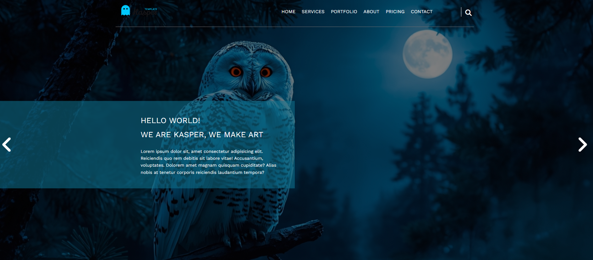

#Template 2 - Responsive Landing Page

A modern responsive landing page built using HTML and CSS, inspired by professional web design layouts. The project focuses on clean structure, reusable components, and full responsiveness across all devices.

---

## 🌐 Live Demo
https://sherift911.github.io/Template-2---Responsive-Landing-Page-HTML-CSS/

---

## 🛠️ Built With
- HTML5
- CSS3
- Flexbox
- CSS Grid
- Font Awesome

---

## 📌 Features
- Fully responsive design (mobile, tablet, desktop)
- Modern and clean UI
- Smooth scrolling navigation
- Organized and reusable CSS structure
- Multiple sections (Services, Portfolio, About, Pricing, Contact)

---

## 📂 Project Structure
├── index.html
├── css/
│ └── style.css
├── images/
│ └── ...
└── README.md

---

## 🚀 How to Run
1. Clone the repository
2. Open `index.html` in your browser

---

## 📢 Notes
This project was built for learning and practice purposes to improve front-end development skills.

---

## 👨‍💻 Author
Sherif Khater
